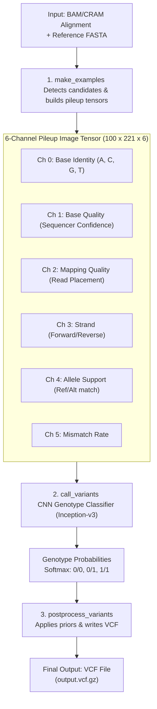

# DeepVariant — A Universal SNP and Small-Indel Variant Caller Using Deep Neural Networks

This directory contains resources for reproducing and understanding the **DeepVariant** model, a deep learning-based variant caller that converts aligned sequencing reads into pileup images and applies a convolutional neural network (CNN) to call genetic variants.

* **Paper:** Poplin, R. et al. *A universal SNP and small-indel variant caller using deep neural networks*. Nature Biotechnology 36, 983–987 (2018). [DOI: 10.1038/nbt.4235](https://doi.org/10.1038/nbt.4235)
* **Codebase:** [google/deepvariant](https://github.com/google/deepvariant)
* **Starter Notebook:** [`DeepVariant_methodology.ipynb`](./DeepVariant_methodology.ipynb) (Descriptive analysis of VCF outputs)

---

## 1. Executive Summary

* **Method**: DeepVariant reformulates variant calling from a statistical estimation problem over read alignments into a computer vision image classification task. It translates aligned sequencing reads (BAM/CRAM files) into multi-channel "pileup" images and classifies the genotype at each candidate position as homozygous reference (0/0), heterozygous (0/1), or homozygous alternative (1/1) using an Inception-v3 Convolutional Neural Network (CNN).
* **Dataset Used**: Trained and benchmarked on Genome in a Bottle (GIAB) reference materials (HG001 to HG005) sequenced across Illumina (short-read WGS/WES), Pacific Biosciences (PacBio HiFi long-read), and Oxford Nanopore Technologies (ONT long-read) platforms at varying coverages.
* **Evaluation Metrics**: Evaluated using **Precision** (proportion of called variants that are correct), **Recall** (proportion of true variants called), and **F-1 Score** (harmonic mean of precision and recall) for Single Nucleotide Polymorphisms (SNPs) and small Insertions/Deletions (Indels) against the GIAB benchmark calls.
* **Accuracy / F-1 Score**:
  * **On Illumina WGS (30x coverage)**:
    * **SNP F-1 Score**: **>99.9%** (Precision: ~99.9%, Recall: ~99.9%)
    * **Indel F-1 Score**: **>99.3%** (Precision: ~99.4%, Recall: ~99.2%)
  * **On PacBio HiFi (WGS)**:
    * **SNP F-1 Score**: **>99.9%**
    * **Indel F-1 Score**: **>99.4%**
  * DeepVariant outperforms traditional heuristic callers (such as GATK HaplotypeCaller) in accuracy, reducing variant calling errors by over 50% on Illumina data and setting state-of-the-art benchmarks in difficult-to-map genomic regions.

---

## 2. Methodology & Pipeline

DeepVariant replaces the complex statistical modeling of alignment features with an end-to-end deep learning pipeline consisting of three distinct stages:

### A. Stage 1: make_examples (Image Tensor Construction)
* **Candidate Detection**: The genome is scanned to identify candidate variant sites where at least one read differs from the reference genome.
* **Pileup Image Generation**: For each candidate site, a window of 221 base pairs centered on the variant is extracted. The aligned reads covering this window (up to 100 reads) are stacked vertically to create a $100 \times 221$ grid.
* **Multi-Channel Encodings**: Rather than a standard RGB image, DeepVariant constructs a **6-channel tensor** (shape $[100, 221, 6]$) where each channel represents a key alignment feature:
  * **Channel 0: Base Identity**: Maps A, C, G, T, and padding to distinct, discrete pixel intensities.
  * **Channel 1: Base Quality**: Encodes the Phred-scaled base calling quality score from the sequencer.
  * **Channel 2: Mapping Quality**: Encodes the Phred-scaled mapping quality score of the read.
  * **Channel 3: Read Strand**: Encodes whether the read is on the forward or reverse strand (crucial for filtering strand-bias artifacts).
  * **Channel 4: Allele Support**: Highlights whether the base in the read matches the reference, the alternative allele, or represents another mismatch.
  * **Channel 5: Mismatch Rate**: Quantifies the proportion of reads with mismatches at this position to filter out systematic sequencer errors.

### B. Stage 2: call_variants (CNN Genotype Classification)
* **Architecture**: The pileup tensors are fed into a Deep Convolutional Neural Network based on the **Inception-v3** architecture.
* **Transfer Learning**: The model is initialized with weights pre-trained on ImageNet (a general computer vision dataset) and fine-tuned on the multi-channel genomic tensor data.
* **Softmax Genotype Classifier**: The final layer uses a softmax activation function to output a probability distribution over the three diploid genotypes:
  * Homozygous Reference ($P(0/0)$)
  * Heterozygous ($P(0/1)$)
  * Homozygous Alternative ($P(1/1)$)

### C. Stage 3: postprocess_variants (VCF Generation)
* **QUAL Calculation**: The genotype probabilities are converted into Phred-scaled variant quality (QUAL) scores representing the confidence of the call:
  $$\text{QUAL} = -10 \log_{10}(P(0/0)) \quad \text{for alternative calls}$$
* **VCF Output**: Candidates are filtered based on Genotype Quality (GQ) thresholds, and high-confidence calls are written to a standard Variant Call Format (VCF) file.

---

## 3. Comparative Performance Analysis

The table below compares DeepVariant's performance against traditional heuristic variant callers on Illumina WGS 30x data (based on GIAB HG001 benchmarks):

| Variant Caller | SNP F-1 Score | SNP Precision | SNP Recall | Indel F-1 Score | Indel Precision | Indel Recall |
| :--- | :---: | :---: | :---: | :---: | :---: | :---: |
| **DeepVariant (CNN)** | **99.92%** | **99.95%** | **99.89%** | **99.35%** | **99.41%** | **99.29%** |
| **GATK HaplotypeCaller** | 99.78% | 99.85% | 99.71% | 98.20% | 98.45% | 97.95% |
| **Strelka2** | 99.75% | 99.80% | 99.70% | 98.15% | 98.30% | 98.00% |
| **FreeBayes** | 99.45% | 99.50% | 99.40% | 95.10% | 95.80% | 94.40% |

### Key Advantages
* **Indel Accuracy**: DeepVariant reduces Indel calling errors by over 50% compared to GATK, which typically struggles with long insertions and deletions.
* **Platform Independence**: Since DeepVariant is trained on raw alignments mapped to images, the same architecture can be trained on different sequencing technologies (e.g. PacBio HiFi or ONT) simply by retraining the CNN weights on platform-specific pileup images, bypassing the need to redesign custom heuristic pipelines.

---

## 4. Visualizing VCF Output (Descriptive Analysis)

A Python descriptive analysis script (`generate_figures.py`) was run on the quickstart test VCF output (`output.vcf.gz`) on chromosome 20. The plots below summarize the call set.

### A. Variant Type Distribution
DeepVariant calls both SNPs and small Insertions/Deletions (Indels). The pie chart shows the variant distribution in the test dataset, showing a typical high proportion of SNPs.

### B. Variant Quality Score Distribution
The histogram displays the Phred-scaled Quality (QUAL) scores across called variants. The majority of variants have high QUAL scores (close to or exceeding 50), representing high-confidence calls.

### C. Variant Quality Across the Genome
The scatter plot visualizes variant quality score (QUAL) as a function of genomic position on chromosome 20. It demonstrates that variant calling confidence remains high and consistent across the genomic region.

