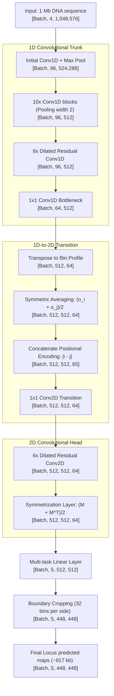

# Akita — Predicting 3D Genome Folding from DNA Sequence

This directory contains resources for reproducing and understanding the **Akita** model, a deep convolutional neural network that predicts 3D chromosome conformation (contact maps) directly from 1D DNA sequence.

* **Paper:** Fudenberg, G., Kelley, D.R. & Pollard, K.S. *Predicting 3D genome folding from DNA sequence with Akita*. Nature Methods 17, 1111–1117 (2020). [DOI: 10.1038/s41592-020-0958-x](https://doi.org/10.1038/s41592-020-0958-x)
* **Codebase:** [calico/basenji/manuscripts/akita](https://github.com/calico/basenji/tree/master/manuscripts/akita)
* **Starter Notebooks:** 
  * [`akita_inference_colab.ipynb`](./akita_inference_colab.ipynb) (Inference with pre-trained model on hg38)
  * [`akita_contactmap_demo.ipynb`](./akita_contactmap_demo.ipynb) (Toy model training in PyTorch)

---

## 1. Executive Summary

* **Method**: Akita uses a deep convolutional neural network consisting of a 1D convolutional "trunk" and a 2D dilated residual convolutional "head". It maps 1D one-hot encoded DNA sequences directly to 2D $\log(\text{observed}/\text{expected})$ contact maps, modeling the biophysical relationships that drive chromosome folding.
* **Dataset Used**: Trained using a multi-task learning framework on five high-quality human Hi-C and Micro-C datasets, binned at a high resolution of 2048 bp ($2^{11}$ bp):
  1. **HFF Micro-C** (Human Foreskin Fibroblasts)
  2. **H1hESC Micro-C** (Human Embryonic Stem Cells)
  3. **GM12878 Hi-C** (Lymphoblastoid)
  4. **IMR90 Hi-C** (Lung Fibroblasts)
  5. **HCT116 Hi-C** (Colorectal Cancer)
* **Evaluation Metrics**:
  * **Mean Squared Error (MSE)**: Measures pixel-wise prediction error on target maps.
  * **Pearson Correlation ($R$) & Spearman Correlation ($R$)**: Quantifies the correlation between target and predicted $\log(\text{observed}/\text{expected})$ maps across held-out 1-Mb genomic test regions.
* **Accuracy (Human Model)**: On the held-out test set, Akita achieves a genome-wide performance of **0.14 MSE, 0.61 Pearson R, and 0.56 Spearman R**. This performance approaches the noise limit established by experimental biological replicates.
* **F-1 Score**: Because Hi-C prediction is formulated as a regression task (predicting continuous contact frequency maps), F-1 scores are not directly computed for the main maps. However, when evaluating the prediction of discrete structural features derived from these maps, Akita's predictions align closely with Topologically Associating Domain (TAD) boundaries and loop peaks called by experimental pipelines (e.g., overlapping strongly with CTCF peaks and DNase-seq boundaries).

---

## 2. Biophysical Modeling & Context

### A. The Loop Extrusion Model
In mammalian interphase, the 3D genome is organized into Topologically Associating Domains (TADs) and chromatin loops. Biophysically, this is governed by the **Loop Extrusion Model**:
1. **Cohesin Extrusion**: Cohesin ring complexes load onto chromatin fibers and actively extrude loops in both directions.
2. **CTCF Halting**: Extrusion is blocked by the zinc-finger protein CTCF when it is bound in a **convergent (pointing towards each other)** orientation. Divergent or parallel orientations do not halt extrusion.
3. **Loop/TAD Formation**: When two CTCF sites in a convergent orientation halt cohesin sliding, a persistent chromatin loop is established, appearing as a "dot" (loop anchor interaction) and a "stripe/domain" on a Hi-C contact map.

```
       Convergent Motif Pair (Halt)             Divergent Motif Pair (No Halt)
    ----[CTCF>]========[<CTCF]----            ----[<CTCF]========[CTCF>]----
           \          /                              \          /
            ) Cohesin (                               ) Cohesin (
           /    ==>   \                              /   <==    \
```

### B. Machine Learning Architecture as a Biophysical Analog
Akita’s architecture mirrors this biophysical mechanism in a two-stage process:
* **1D Trunk (Motif Scanning)**: The initial 1D convolutional layers act as local sequence detectors, scanning the DNA matrix much like Position Weight Matrices (PWMs) to detect CTCF motifs and other transcription factor binding sites.
* **2D Head (Spatial Interaction Propagation)**: The 2D dilated residual convolution head treats the contact matrix as a 2D spatial grid. The dilated convolutions systematically diffuse information over expanding genomic distances, mimicking the process of cohesin loop extrusion propagating structural interactions along the diagonal.

---

## 3. System Flowchart & Dimensional Flow

The diagram below details the structural layers of the Akita architecture and the exact tensor transformations at each layer boundary.



### Detailed Network Specifications

1. **Data Preprocessing & Normalization**:
   * Hi-C data is binned into $2048\text{ bp}$ ($2^{11}$ bp) bins.
   * Target values are normalized for distance-decay using $\log(\text{observed}/\text{expected})$ and clipped to $[-2, 2]$.
   * Non-overlapping virtual contigs of $2^{20}\text{ bp}$ (~1 Mb) are extracted and one-hot encoded (shape $[4, 1,048,576]$).
2. **1D Trunk**:
   * **Initial Block**: Conv1D (filter size 11, stride 1, padding 5), Batch Normalization, ReLU, Max Pooling (size 2, stride 2).
   * **1D Conv Tower**: 10 residual blocks with Conv1D (filter size 5), Batch Normalization, ReLU, Max Pooling (size 2), downsampling length from $524,288$ to $512$ bins.
   * **Dilated 1D Tower**: 8 residual Conv1D blocks with dilation rates of $1, 2, 4, 8, 16, 32, 64, 128$ to expand receptive fields to cover the entire 1-Mb context.
   * **Bottleneck**: $1 \times 1$ Conv1D with 64 filters.
3. **1D-to-2D Transition**:
   * The 1D representations of genomic bins $i$ and $j$ are averaged to build a 2D grid:
     $$t(i, j, k) = \frac{o_i(k) + o_j(k)}{2}$$
   * The absolute genomic distance $|i - j|$ is appended as a 65th filter channel to represent the biophysical distance-decay parameter.
4. **2D Head**:
   * **Dilated 2D Tower**: 6 residual Conv2D blocks (filter size $3 \times 3$) with dilation rates of $1, 2, 4, 8, 16, 32$.
   * **Symmetrization Layer**: The matrix is symmetrized at each layer: $S_{ij} = \frac{M_{ij} + M_{ji}}{2}$.
   * **Multi-task Output & Crop**: Predicts 5 channels (one for each dataset). The outer 32 bins on each side are cropped to remove border artifacts, outputting symmetric $448 \times 448$ contact maps (~917 kb).

---

## 4. Empirical Performance & Comparative Analysis

The table below shows the performance of the human multi-task model on the held-out test set compared to single-task models and the biological replicate noise limits (as documented in Extended Data Figs. 1 and 2 of the paper).

| Dataset | Akita (Multi-Task) Pearson $R$ | Single-Task Pearson $R$ | Biological Replicate Correlation ($R$) | Genome-Wide MSE |
| :--- | :---: | :---: | :---: | :---: |
| **HFF Micro-C** | **0.61** | 0.58 | 0.65 | 0.12 |
| **H1hESC Micro-C** | **0.61** | 0.61 | 0.66 | 0.13 |
| **GM12878 Hi-C** | **0.53** | 0.48 | 0.58 | 0.15 |
| **IMR90 Hi-C** | **0.53** | 0.47 | 0.57 | 0.15 |
| **HCT116 Hi-C** | **0.51** | 0.46 | 0.55 | 0.16 |
| **Average** | **0.56** | 0.52 | 0.60 | 0.14 |

### Performance Insights
* **Replicate Noise Limit**: Akita's average Pearson correlation ($0.56$) closely approaches the experimental replicate noise ceiling ($0.60$), demonstrating that the network extracts almost all of the sequence-dependent signal present in modern conformation capture data.
* **Benefits of Multi-Task Learning**: Jointly training on all 5 datasets regularizes the trunk features and improves generalization, yielding a $+0.04$ average correlation boost over models trained on individual datasets.

---

## 5. Visualizing the PyTorch reproduction

To demonstrate the biophysical training and in silico predictions, a PyTorch replication script (`generate_demo_figures.py`) was run on synthetic sequence profiles. The plots below showcase the training process, predictions, and CTCF motif deletion experiments.

### A. Toy Model Training Loss
The MSE loss curve over 60 epochs shows stable convergence when training on synthetic sequences containing convergent CTCF pairs.


### B. Target vs. Prediction Comparison
The trained PyTorch model successfully recovers the domain boundary structure and loop anchors (bright interaction dots) generated by the synthetic sequence.


### C. In Silico CTCF Mutagenesis
By mutating the convergent CTCF binding motifs in silico, the predicted boundary and loop structures disappear. This demonstrates that the model learns the causal relationship between sequence features and spatial folding.


---

## 6. PyTorch Implementation (Demo Architecture)

Below is the PyTorch implementation of the `MiniAkita` architecture used for synthetic training. It demonstrates the trunk-head separation, 1D-to-2D symmetric averaging, and absolute distance positional encoding.

```python
import torch
import torch.nn as nn
import numpy as np

class MiniAkita(nn.Module):
    """
    MiniAkita is a PyTorch demonstration of the Akita architecture.
    It encodes a 1D sequence, projects it to a 2D contact map,
    incorporates genomic distance, and enforces symmetric folding.
    """
    def __init__(self, embedding_dim=32, num_bins=16):
        super(MiniAkita, self).__init__()
        self.num_bins = num_bins
        self.embedding_dim = embedding_dim
        
        # 1. 1D Trunk: Convolutions + Max Pooling to reduce sequence length to genomic bins
        self.trunk = nn.Sequential(
            nn.Conv1d(in_channels=4, out_channels=48, kernel_size=15, padding=7),
            nn.ReLU(),
            nn.Conv1d(in_channels=48, out_channels=embedding_dim, kernel_size=15, padding=7),
            nn.ReLU(),
            nn.AdaptiveMaxPool1d(num_bins) # Downsamples sequence to `num_bins` representation
        )
        
        # 2. 2D Head: Projects concatenated averaged features and positional encodings
        # Input size to Linear: (2 * embedding_dim) + 2 positional encoding coordinates
        self.head = nn.Sequential(
            nn.Linear(in_features=(2 * embedding_dim) + 2, out_features=64),
            nn.ReLU(),
            nn.Linear(in_features=64, out_features=1)
        )
        
        # Register positional coordinate buffer [0, 1] across bins
        self.register_buffer("pos", torch.linspace(0, 1, num_bins))

    def forward(self, x):
        # x shape: [Batch, 4 (one-hot channels), sequence_length]
        
        # 1. Trunk Forward
        E = self.trunk(x).transpose(1, 2)  # [Batch, num_bins, embedding_dim]
        B, nb, d = E.shape
        
        # 2. 1D to 2D Transition
        # Tile representations to create pairs of genomic bins (i, j)
        Ei = E[:, :, None, :].expand(B, nb, nb, d)
        Ej = E[:, None, :, :].expand(B, nb, nb, d)
        
        # Tile positional coordinates
        pi = self.pos[None, :, None, None].expand(B, nb, nb, 1)
        pj = self.pos[None, None, :, None].expand(B, nb, nb, 1)
        
        # Concatenate features: [Batch, num_bins, num_bins, (2 * d + 2)]
        concat_features = torch.cat([Ei, Ej, pi, pj], dim=-1)
        
        # 3. Predict & Symmetrize
        M = self.head(concat_features).squeeze(-1)  # [Batch, num_bins, num_bins]
        symmetric_map = 0.5 * (M + M.transpose(1, 2))
        
        return symmetric_map

# Example Usage & Verification:
if __name__ == "__main__":
    # Batch size = 2, Sequence length = 512 bp, num_bins = 16 (each bin represents 32 bp)
    model = MiniAkita(embedding_dim=32, num_bins=16)
    dummy_input = torch.randn(2, 4, 512)
    predicted_maps = model(dummy_input)
    
    print("Input sequence shape:", dummy_input.shape)
    print("Predicted contact maps shape:", predicted_maps.shape)
    
    # Check that output is symmetric
    is_symmetric = torch.allclose(predicted_maps, predicted_maps.transpose(1, 2), atol=1e-6)
    print("Are predicted maps symmetric?", is_symmetric)
```
