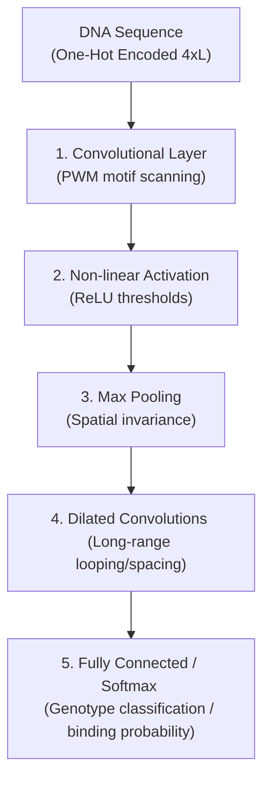

# Deep Learning: New Computational Modelling Techniques for Genomics

This directory contains resources for reproducing and understanding the concepts in the **2019 Nature Reviews Genetics** review paper on deep learning in genomics. It includes a self-contained PyTorch workflow demonstrating motif detection and in-silico mutagenesis.

* **Paper:** Eraslan, G., Avsec, Ž., Gagneur, J. & Theis, F. J. *Deep learning: new computational modelling techniques for genomics*. Nature Reviews Genetics 20, 389–403 (2019). [DOI: 10.1038/s41576-019-0122-6](https://doi.org/10.1038/s41576-019-0122-6)
* **Codebase:** N/A (Review paper; surveys multiple tools like DeepBind, DeepSEA, Basset, Basenji, and Kipoi)
* **Starter Notebook:** [`deep_learning_genomics_review_demo.ipynb`](./deep_learning_genomics_review_demo.ipynb) (CTCF motif CNN classification and sat-mutagenesis)

---

## 1. Executive Summary

* **Method**: The paper reviews and systematizes deep learning (DL) architectures used in genomics. By replacing manual feature engineering (e.g. designing $k$-mer counts) with end-to-end models, deep neural networks learn complex sequence representations directly from raw data. The review outlines:
  1. **Supervised Architectures**: Fully Connected (MLP), Convolutional (CNN), Recurrent (RNN), and Graph Convolutional Networks (GCN).
  2. **Multi-Task & Transfer Learning**: Sharing parameters across cell types/assays, and transferring pre-trained weights to data-scarce settings.
  3. **Interpretation Techniques**: Perturbation-based (in-silico mutagenesis) and backpropagation-based (saliency maps, DeepLIFT, Integrated Gradients) attribution methods.
  4. **Unsupervised Architectures**: Autoencoders (scRNA-seq imputation/denoising) and Generative Adversarial Networks (GANs for DNA design).
* **Dataset Used**: The review surveys models trained on a variety of functional genomics datasets: ChIP-seq (TF binding), DNase-seq/ATAC-seq (chromatin accessibility), RNA-seq (splicing and gene expression), Hi-C (3D chromatin interactions), and scRNA-seq (single-cell transcriptomics).
* **Evaluation Metrics**: Emphasizes standard metrics: Pearson/Spearman correlation (for regression tasks), and Area Under the ROC Curve (ROC-AUC) or Precision-Recall Curve (PR-AUC) (for balanced/imbalanced binary classification).
* **Accuracy / F-1 Score**: Surveys several benchmark papers (e.g., DeepBind, DeepSEA, Basset, and Basenji) showing that deep learning models consistently achieve state-of-the-art performance, outperforming traditional classifiers (such as gkm-SVMs, random forests, and logistic regression) in regulatory variant effect prediction and motif discovery.

---

## 2. Deep Learning Architectures in Genomics

The paper details how different deep learning layers capture specific biological dependencies:



### A. Convolutional Neural Networks (CNNs)
* **Biological Analogy**: First-layer convolutional filters function as scanning **Position Weight Matrices (PWMs)**. The filter weights correspond to sequence motifs (e.g., binding sites for transcription factors).
* **Pooling**: Max pooling downsamples spatial resolution, providing translation invariance (the exact position of the motif in the sequence becomes less critical).
* **Composition**: Downstream convolutional layers compose motifs from the first layer, allowing the model to learn complex grammars, such as preferred spacing and orientation between transcription factors.
* **Long-Range Interaction**: Dilated convolutions (convolutions that skip bases with a step size) allow the model to expand its receptive field exponentially (e.g., 32 kb in Basenji), capturing enhancer-promoter loops and chromatin folding rules.

### B. Recurrent Neural Networks (RNNs)
* **Sequential Dependency**: RNNs process sequences base-by-base, maintaining a memory state of the sequence history.
* **Applications**: Suited for variable-length transcripts (mRNAs) or continuous electrical signal data (such as raw Nanopore sequencing current reads in DeepNano).

### C. Graph Convolutional Networks (GCNs)
* **Non-Euclidean Data**: Generalizes convolutions from regular grids (like 1D sequences or 2D images) to graphs.
* **Applications**: Modeling protein-protein interactions (PPIs), gene regulatory networks, and 3D molecular/protein folding configurations.

---

## 3. Comparative Architecture Analysis

| Network Type | Connectivity / Sharing | Invariance | Typical Genomics Input | Key Application | Limitations |
| :--- | :--- | :---: | :--- | :--- | :--- |
| **Fully Connected (MLP)** | Dense / None | None | Tabular features, $k$-mer counts | Variant pathogenicity | Ignores sequence locality; overfits |
| **Convolutional (CNN)** | Local / Weight Sharing | Translation | One-hot DNA/RNA, epigenomic tracks | TF binding, chromatin accessibility | High memory; struggles with variable lengths |
| **Recurrent (RNN)** | Sequential / Temporal Sharing | Position | Variable-length sequences, Nanopore current | mRNA splicing, base calling | Slow training; difficult to parallelize |
| **Graph Convolutional (GCN)** | Node-Neighborhood / Structural | Node Order | PPI networks, 3D structure | Protein function, drug discovery | Computationally expensive; graph noise |

---

## 4. Visualizing CNN Motif Detection & Mutagenesis Workflow

A Python script ([`generate_figures.py`](./generate_figures.py)) was executed using a synthetic dataset of 4,000 sequences (2,000 positive, 2,000 negative) with a planted CTCF-like binding motif (`CCGCGNGGNGGCAG`). A simple CNN model (`Conv1d(4,16,15) -> MaxPool -> Linear(16,1)`) was trained for 15 epochs.

### A. Training Loss Curve
The BCE loss decreases steadily from 0.693 to 0.137, showing stable convergence on the synthetic motif classification task.


### B. ROC Curve
The model achieves a test set classification accuracy of **0.993** and a ROC-AUC score of **1.000**, successfully learning the sequence grammar of the CTCF motif.


### C. In-Silico Mutagenesis (ISM) Heatmap
By systematically mutating every base in a positive test sequence and measuring the change in the predicted binding probability ($\Delta P(\text{bound})$), the script maps the functional importance of each position. The resulting heatmap highlights the planted motif at the beginning of the sequence.


---

## 5. Reference PyTorch Implementation

Below is the complete PyTorch code block utilized in the descriptive notebook to train the motif classifier and execute in-silico saturation mutagenesis:

```python
import torch
import torch.nn as nn
import numpy as np

# 1. Define Motif Classifier CNN
class MotifCNN(nn.Module):
    def __init__(self):
        super().__init__()
        # Conv1d scanning layer: 4 channels (A,C,G,T), 16 filters, width=15
        self.conv = nn.Conv1d(in_channels=4, out_channels=16, kernel_size=15)
        self.fc = nn.Linear(16, 1)
        
    def forward(self, x):
        # x shape: (batch_size, 4, seq_len)
        x = torch.relu(self.conv(x))
        # Global Max Pooling across the sequence length
        x = x.max(dim=2).values
        return self.fc(x)

# 2. In-Silico Saturation Mutagenesis Function
def run_in_silico_mutagenesis(model, one_hot_sequence):
    """
    Mutates each position in the sequence to all 4 alternative bases
    and measures the difference in predicted binding probability.
    """
    model.eval()
    seq_len = one_hot_sequence.shape[1]
    
    # Calculate baseline probability
    with torch.no_grad():
        baseline_prob = torch.sigmoid(model(torch.tensor(one_hot_sequence[None]))).item()
        
    ism_matrix = np.zeros((4, seq_len), dtype=np.float32)
    
    for pos in range(seq_len):
        for base_idx in range(4):
            # Create mutated sequence copy
            mutated_seq = one_hot_sequence.copy()
            mutated_seq[:, pos] = 0
            mutated_seq[base_idx, pos] = 1
            
            # Predict mutated binding probability
            with torch.no_grad():
                mut_prob = torch.sigmoid(model(torch.tensor(mutated_seq[None]))).item()
                
            # Store delta score
            ism_matrix[base_idx, pos] = mut_prob - baseline_prob
            
    return ism_matrix
```
